# Project 3 - Algorithmic Experiments of Real-World Phenomena

## Table of Contents

* [Overview](#overview)

* [Graph Algorithms](#Graph-Algorithms)

    * [Diameter Algorithm](#1.-Diameter-Algorithm)

    * [Clustering-coefficient Algorithm](#2.-Clustering-coefficient-Algorithm)

    * [Degree-Distribution Algorithm](#3.-Degree-Distribution-Algorithm)

* [Graph Model](#Graph-Model)

* [Graph Algorithm Testing](#Graph-Algorithm-Testing)

    * [Test Goal](#1.-Test-Goal)

    * [Test Method](#T2.-est-Method)

    * [Test Result & Analysis](#3.-Test-Result-&-Analysis)

* [Conclusion](#Conclusion)

## Overview

This project involves testing various graph algorithms experimentally to determine properties of models of real-world networks. The specific 3 graph algorithms to be tested are: 

* Diameter algorithm

    * Compute the length of a longest path in the graph

* Clustering-coefficient algorithm

    * Compute the ratio of three times the number of triangles over the number of paths of length 2

* Degree-distribution algorithm

    * For each possible degree, calculate the number of vertices in the graph with that degree

The three algorithms above will be tested to determine the properties of random graphs generated by **Barabasi-Albert (BA)** Model.

## Graph Algorithms

In terms of computational representation of networks, graph is epresented as an **Ajacency List** which is a vector of nodes and each node points a vector of neighbor nodes. This is my implementation of graph.

### 1. Diameter Algorithm

**Assumption:**

This diameter algorithm is used to calculate the diameter of a connected unweighted graph (e.g. each edge has weight: 1).

**Description:**

Diameter algorithm is used to calculate the maximum distance between a pair of vertices in the network. Given the assumption that the input graph is connected, the distance between two vertices is the length of the shortest path connecting them.

The diameter of a network measures how near or far typical nodes are from each other.

**Definition**

* Consider a connected undirected and unweighted graph G = (V, E) with n = |V| nodes and m = |E| edges.

* Distance d(v, w): length of shortest path between nodes v and w in V.

* Diameter D(G): maximal distance (longest shortest path length) over all nodes pairs, which is ***max(d(v, w))*** .

**Algorithm**

The naive solution of diameter algorithm is to find the largest value returned by All Pairs Shortest Path algorithm. This algorithm has a complexity: O(mn) which can run very slowly for large networks.

The basic idea of my implementation is based on a heuristic idea shown in the **Pseudocode section.

**Pseudocode:**

```
1. Initialize diameter d = 0

2. Initialize start vectex s = a random vertex r from V

3. Select the farthest node w from s using breadth first search (BFS).

4. if the distance between w and r is larger than diameter:
        s = w
        d = d(s, w)
        repeat Step 3
   else:
        return d
```

### 2. Clustering-coefficient Algorithm

**Description:**

Clustering coefficient C of a graph = 3 * number of triangles / number of 2-edge paths. To calculate the clustering coefficient of a graph, we have to find the number of triangles and the number of 2-edges paths in the graph.

**Idea**

Computing the number of 2-edge path is easier. For each vertex, find the number of path with v in the middle. Its sum is the number of 2-edge path.

Computing the number of triangles in the grpah is tricky. However, the concept of graph degenracy simplifies the time complexity of triangle counting algorithm. The degeneracy of a graph is the smallest value
of d for which every subgraph has a vertex of degree at most d. If a graph has degeneracy d, then there exists an ordering of the vertices of G in which each vertex has at most d neighbors that are earlier in
the ordering.

**Pseudocode (Find number of 2-edge path):**

```
For each vertex v, let deg(v) denote its degree.

The number of paths of length 2 with v in the middle
is deg(v) choose 2 = deg(v)(deg(v)-1)/2.

Sum up deg(v)(deg(v)-1)/2 for all vertices, v, in G. The result is the number of 2-edge path in graph G.
```

**Pseudocode (Find reversed degeneracy order of graph):**

```
Initialize an empty output list, L.

Repeatedly find and remove the vertex of
smallest degree, adding it to the beginning of list L, until there is no more vertex in graph G.
```

**Pseudocode (Find number of triangles using reversed degeneracy order):**

```
Loop through vertices reversed degeneracy ordering, L calculated above:

    For each vertex, v:

        For each pair of vertices, u and w, adjacent to v
        and earlier in the ordering, i.e., u and v are in the
        list N_v from the degeneracy algorithm:

            If (u,w) is an edge in the graph, then add one
            to the triangle count.
```

At last, clustering coefficient C = 3 * number of triangles / number of 2-edge paths.

**Time complexity**:

Running time is O(d^2 n) = O(dm) expected, assuming edges are stored in a hash table. d is degeneracy of the graph G.

### 3. Degree-Distribution Algorithm

**Description:**

Degree-distribution algorithm is used to determine for each possible degree, the number of vertices in the graph with that degree. In my implementation, I use a map to represent degree distribution, in which the key of map is degree and the correpsonding value is the number of vertices with that degree.

The basic idea of this algorithm is to loop through each node(vertex) in the adjacency list and for each node, retreive the length (degree) of vector that represents its neighbors. Increment the value associated with this degree in the map.

**Pseudocode:**

```
Create an empty map, M, in which key represents possible degree and corresponding value represents the number of vertices with that degree in the graph.

Loop through each node, v, in adjacency list:
    
    Computer the degree, deg(v), which is the number of elements (neighbor nodes) is its list(vector).

    if M doesn't have a key equal to deg(v):
        Put deg(v) into M and set its corresponding value to 1.
    else:
        Increment M[deg(v)] by 1
```

This algorithm has an overall time complexity of **O(N)**, since it loops through each node in the graph only once. The complexity of get the number of neighbor nodes is O(1) if using vector. Inserting key into map also has complexity O(1).

## Graph Model

### Introduction

The Barabási–Albert (BA) model is an algorithm for generating random scale-free networks using a preferential attachment mechanism. Several natural and human-made systems, including the Internet, the world wide web are thought to be approximately scale-free and certainly contain few nodes (called hubs) with unusually high degree as compared to the other nodes of the network.

In this project, I will use different sizes of random graphs generate by BA model to test the three graph algorithms.

### Faser Barabasi-Albert (BA) Algorithm

The input of the faster BA model algorithm is the number of nodes in the graph (n) and minimum degree d (d >= 1). The basic idea of this algorithm is that as each node comes into the graph, it connects to d other nodes with probability proportional to its degree. The output of this graph is a multigraph containing multi-edges and self loops. For testing, we will avoid generating multi-graph by using a hash table to check if the edge to be added is already in the grpah or not.

**Pseudocode:**

```
    Input: n, number of vertices; d, minimum degree >= 1.

    G = ({0, ..., n - 1}, E)

    M: array of length 2nd
    for v = 0, ..., n - 1 do:
        for i = 0, ..., d - 1 do:
            M[2(vd + i)] <- v
            draw r in [0, 2(vd + i)] uniformly at random
            M[2(vd + i) + 1] = M[r]
    
    Initialze E to be an empty edge set.

    for i = 0, ..., nd - 1 do:
        Edge e = (M[2i], M[2i + 1])
        if (e is not a self loop edge and is not in E):
            add e to E
    
    return graph G
```

## Graph Algorithm Testing

The goals of our testing are:

1. Determine the diameter of multiple random graphs of length n, as n grows. Determine whether diameter grows, decreases or remains constant as a function of n. If the diameter grows, determine if it grows proporitonal to the function, log n, or according to a function that grows faster or slower than the function, log n.

2. Determine the clustering coefficient of multiple random graphs of length n, as n grows. Determine whether clustering coefficient grows, decreases or remains constant as a function of n. If the clustering coefficient grows, determine if it grows proporitonal to the function, log n, or according to a function that grows faster or slower than the function, log n.

3. Determine whether the degree distribution of randomly generate graph has a power law. If the degree distribution has a power law, find the slope of a line fitting the data in the log-log scale and report on the exponent of that power law.

### 2. Test Method

**Goal 1 & 2**: As the number of vertices, n, in the randomly generated graph grows, calculate the **average** diameter and clustering coefficient by running 5 times for each size of graph. Plot average diameter and clustering coefficient with the number of vertices (n) on a lin-log scale. In addition, perform regression analysis to find the relation between diameter/clustering coefficient and number of vertices (n).

**Note:** A lin-log plot uses a logarithmic scale on the x-axis, and a linear scale on the y-axis.

**Goal 3**: For each number of vertices, n = 1,000, n = 10,000, and n = 100,000, plot the degree distribution of an instance of your chosen type of random graph having that number of vertices. Plot the degree-distribution results on a regular (lin-lin) scale and a log-log scale. If the degree distribution has a power law, perform regression analysis to find the slope of a line fitting the data in the log-log scale and report on the exponent of that power law.

***Power Law:*** A distribution has a power law if P(k) = ck ^ (-a), for constants, c and a.


### 3. Test Result & Analysis

* **Diameter:**

    As number of vertices n grows from 4 to 131072 (= 2^17), plot the average diameter in a lin-log scale (base of logartihm is 2). The graph is shown as below.

    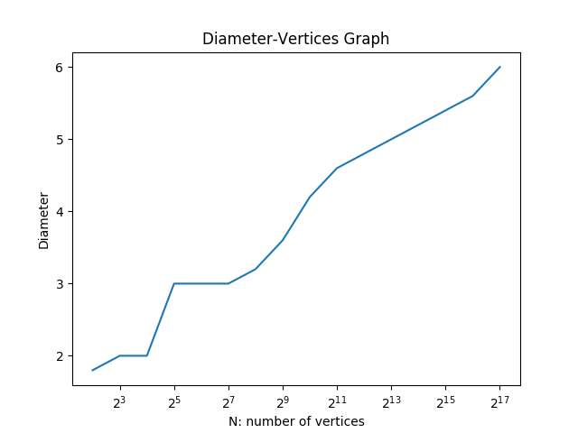

    As shown in the graph above, diameter grows as number of vertices (n) grow. Therefore, diameter grows as a function of n.

    ***Regression Analysis:***

    To determine if diameter grows proportional to the function, log(n), or according to a function that grows faster or slower than the function, log n, we need to perform regression analysis on lin-log scale. Results of regression analysis is shown in the graph below.

    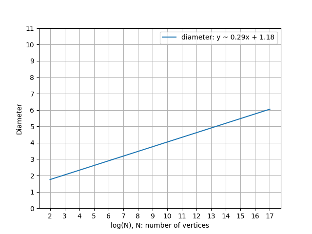

    As shown in the graph, the line that fits into the data points represents the relation between diameter of graph and number of vertices in the graph, which is: Diameter ~ 0.29x + 1.18, x = log(#vertices). Therefore, diameter grows proportional to log(n). The slope is approximately equal to 0.29.

* **Clustering coefficient:**

    Similar to the analysis of graph diameter, as number of vertices n grows from 4 to 65536 (= 2^16), plot the average diameter in a lin-log scale (base of logartihm is 2). The graph is shown as below.

    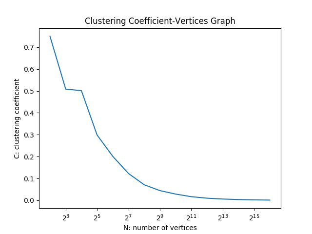

    According to the plotting, we can observe that clustering coefficient of a graph decereases as the number of vertices grows. Based on this fact, we can derive the conclusion that clustering coefficient decreases as a function of n.

* **Degree distribution:**

    For each size of graph (n = 1000, 10000, 100000), to find if its degree distribution have a power law, we first need to plot the degree distribution of randomly generated graph using Barbasi-Albert model. The degree distribution results is plotted on both regular (lin-lin) scale and log-log scale.

    After plotting, if the graph has a heavy/long tail, we can determine that its degree distribution has a power law, which can be further verified by finding the slope of the line fitting into the data in the log-log scale and the exponent of that power law, we can perform regression analysis.

    **Reasoning:**

        1. A distribution has a power law if P(k) = ck ^ (-a), for constants, c and a.
        
        2. We can derive: log P(k) = log c + (-a * log k)
        
        3. By substituting b = log c, y = log P(k), and x = log k, we can get: y = (-a) x + b

        4. Therefore, the exponent of power law is the slope of the line fitting into the data in the regression analysis on log-log scale.


    * Number of vertices (n) = 1000

        **lin-lin scale**

        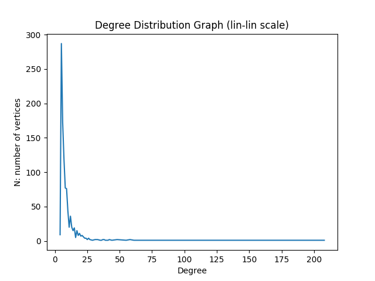

        
        **log-log scale**

        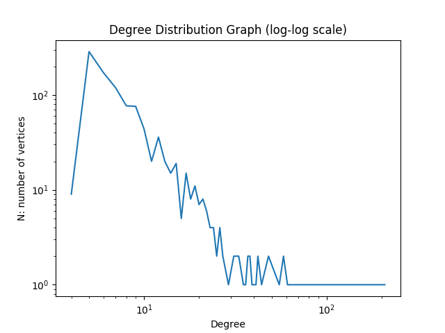

        **Regression Analysis:**

        As shown in the image, the graph has a long tail. To further verify if the degree distribution has a power, we perform regression analysis shown below. We can find that: y ~ -1.59x + 9.7, y = log(#vertices), x = log(degree).

        According to the proof above, the slope of the line fitting into data is: -1.59. The exponent (-a) of the power law is: -1.59.

        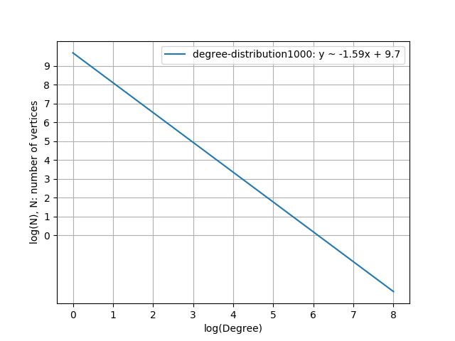

    * Number of vertices (n) = 10000

        **lin-lin scale**

        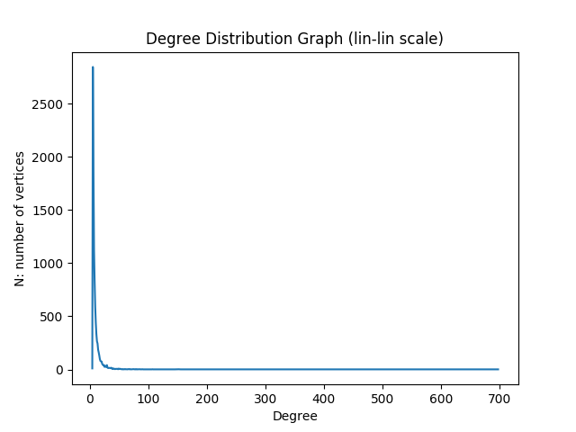

        **log-log scale**

        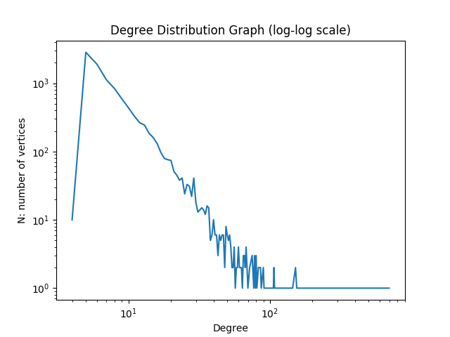

        **Regression Analysis:**

        As shown in the image, the graph has a long tail. To further verify if the degree distribution has a power, we perform regression analysis shown below. We can find that: y ~ -1.86x + 13.26, y = log(#vertices), x = log(degree).

        According to the proof above, the slope of the line fitting into data is: -1.86. The exponent (-a) of the power law is: -1.86.

        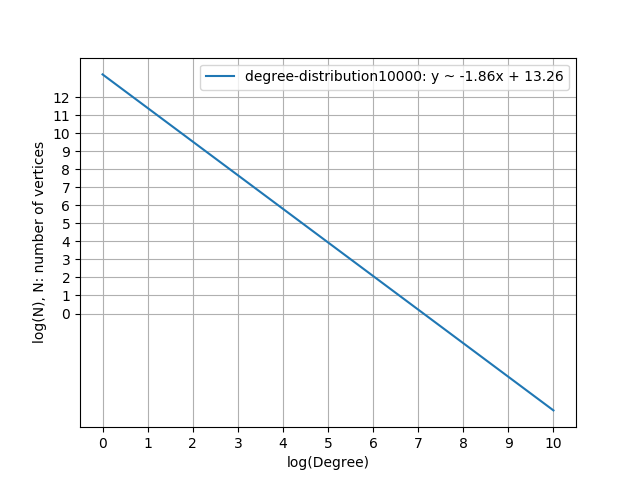

    * Number of vertices (n) = 100000

        **lin-lin scale**

        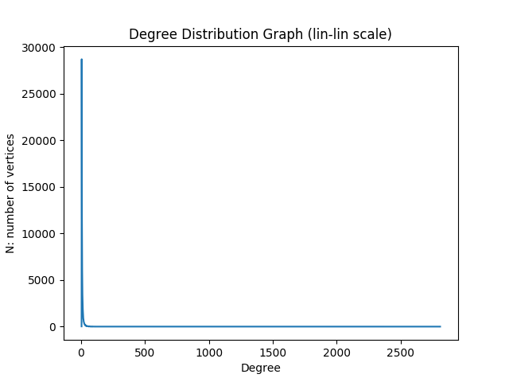

        **log-log scale**

        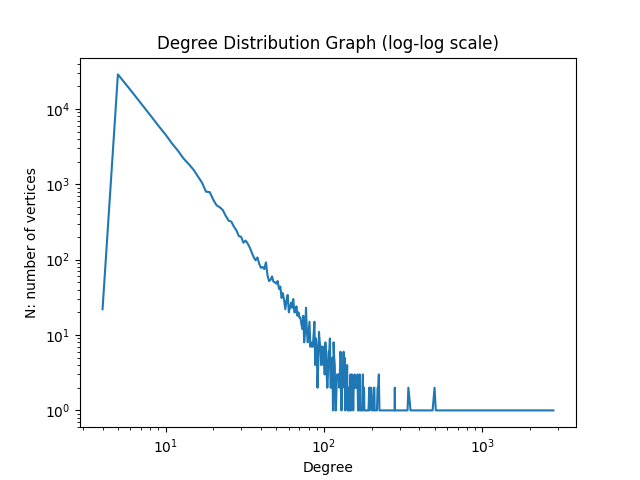

        **Regression Analysis:**

        As shown in the image, the graph has a long tail. To further verify if the degree distribution has a power, we perform regression analysis shown below. We can find that: y ~ -2.02x + 16.51, y = log(#vertices), x = log(degree).

        According to the proof above, the slope of the line fitting into data is: -2.02. The exponent (-a) of the power law is: -2.02.

        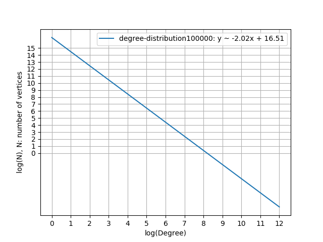

## Conclusion

Overall, the diameter of graph grows as a function of n and grows proportional to the function, log n. Clustering coefficient decreases as a function of n. The degree distribution of graph (have number of vertices = 1000, 10000, 100000) has a power law. The expoents (of power law)/slopes of fitting lines are -1.59, -1.86, -2.02, respectively.
